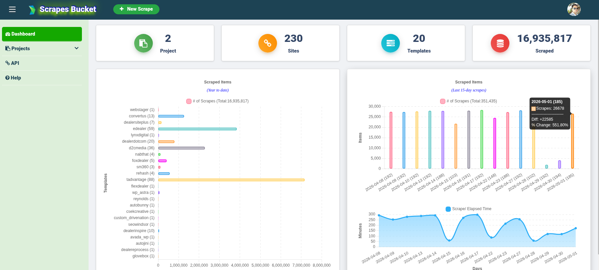
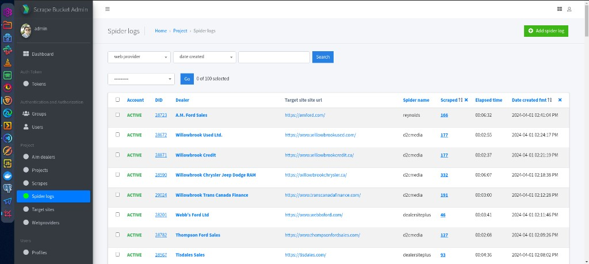
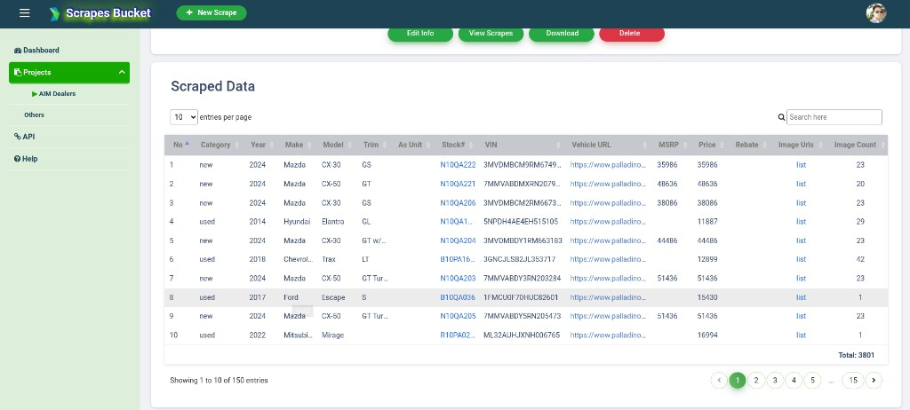
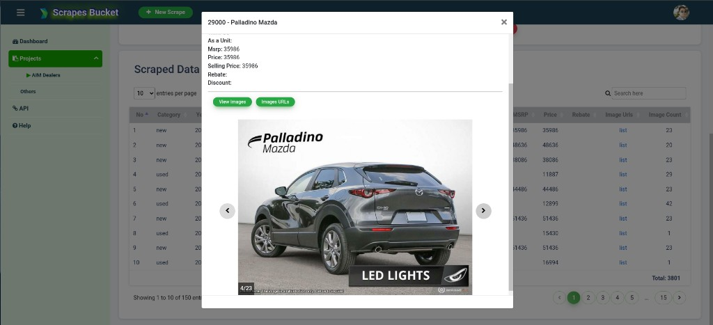
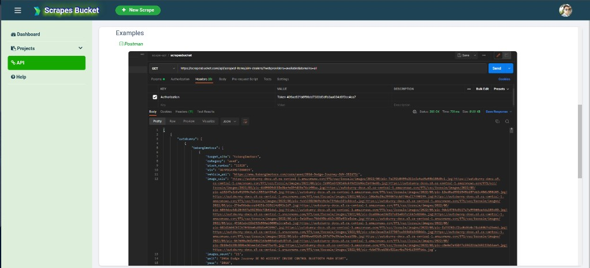
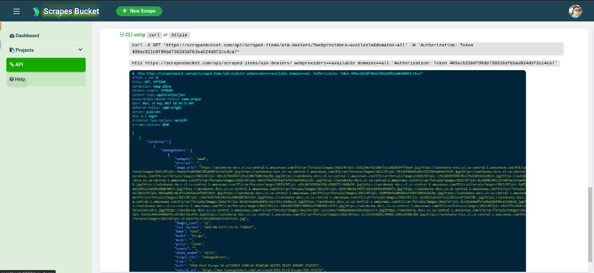

# VDP URL Scraper (Scrapes Bucket)

Django application for managing dealer **vehicle detail page (VDP)** scraping: target sites, spider templates, crawl stats, and a dashboard for monitoring scrape volume over time. Scrapy spiders live under `scrapebucket/` and persist results through Django pipelines.



## Product screenshots

### Admin: spider logs



### Project: scraped data table



### Project: image preview modal



### API examples (Postman and CLI)




## Features

- **Web dashboard** — KPIs (projects, sites, templates, scraped item counts), YTD template breakdown, recent scrape activity, and scraper elapsed-time trends.
- **30+ dealer spiders** — WordPress themes (Avada, Astra, Motors), Dealer Inspire, eDealer, Flex Dealer, SM360, Reynolds, Convertus/Trader, JSON APIs, and Selenium/Playwright for JS-heavy sites.
- **REST API** — Supporting integrations under `project/api/`.
- **Ops hooks** — Optional FTP export of VDP CSVs (`VdpUrlsMiddleWare`), per-crawl stats logged to `SpiderLog`, and cron-friendly `runspider.py` entrypoint.

## Stack

- Python 3.9+ (3.13 supported)
- Django, Scrapy, Django REST Framework
- PostgreSQL or SQLite (see `webscraping/settings.py`)
- Optional: Selenium / Playwright / undetected-chromedriver for specific spiders

## Repository layout

```
├── docs/                        # Documentation assets (screenshots, etc.)
├── fixtures/                    # Sample / initial data
├── logs/                        # Spider log output (create as needed)
├── project/                     # Main Django app (models, views, admin, API, templates)
├── scrapebucket/                # Scrapy project root
│   ├── runspider.py             # Twisted/Scrapy runner — sequential crawls from DB targets
│   └── scrapebucket/            # Scrapy package
│       ├── django_setup.py      # Idempotent Django bootstrap (called once from settings.py)
│       ├── settings.py          # Scrapy settings + Django bootstrap
│       ├── pipelines.py         # Persists items → Scrape model
│       ├── middlewares.py       # Downloader/spider middlewares, Selenium drivers, stat logging
│       ├── items.py             # Item definitions
│       ├── urls_crawl.py        # Maps TargetSite records to spider classes
│       ├── utils.py             # O'Regans CDN URL builders, cookie helpers
│       └── spiders/             # One module per dealer platform (~30 spiders)
├── static/                      # CSS, JS
├── users/                       # Auth and user-facing views
├── webscraping/                 # Django project (settings, URLs, WSGI/ASGI)
├── manage.py
└── requirements.txt
```

## Quick start (local)

### 1. Clone and virtualenv

```bash
git clone https://github.com/paultumabini/vdp-urls-scraper.git
cd vdp-urls-scraper
python3 -m venv venv
source venv/bin/activate   # Windows: venv\Scripts\activate
pip install -r requirements.txt
```

### 2. Environment variables

For day-to-day **development** you can rely on defaults in `webscraping/settings.py` (`DEBUG` defaults to `True` when `DJANGO_DEBUG` is unset). For **production**, set at least:

| Variable | Purpose |
|----------|---------|
| `DJANGO_DEBUG` | Set to `0` or `false` in production |
| `DJANGO_SECRET_KEY` | Required when `DEBUG` is false (never use the repo fallback key) |
| `DJANGO_ALLOWED_HOSTS` | Comma-separated hostnames |
| `POSTGRES_*` / `DB_*` | See `webscraping/settings.py` for database config |
| `AIM_FTP_HOST`, `AIM_FTP_USER`, `AIM_FTP_PASS` | FTP export of VDP CSVs (optional locally) |
| `AIM_FTP_PORT` | FTP port (default `21`) |
| `AVAIM_*` / `GS_*` | External API integrations where used |

Example (optional shell file, e.g. `~/.envars`):

```bash
export DJANGO_SECRET_KEY="your-secret-key"
export DJANGO_DEBUG=1
# export DJANGO_ALLOWED_HOSTS=localhost,127.0.0.1
# export AIM_FTP_HOST=...
# export AIM_FTP_USER=...
# export AIM_FTP_PASS=...
```

### 3. Database and superuser

```bash
venv/bin/python manage.py migrate
venv/bin/python manage.py createsuperuser
venv/bin/python manage.py runserver
```

Open the app (default: `http://127.0.0.1:8000/`) and `/admin/` as needed.

## Running spiders

`runspider.py` lives inside the `scrapebucket/` directory. Run it from the **repository root**:

```bash
# Run one spider against all active targets that use it
venv/bin/python scrapebucket/runspider.py -s <spider_name>

# Examples
venv/bin/python scrapebucket/runspider.py -s webstager
venv/bin/python scrapebucket/runspider.py -s all   # wipes all Scrape rows first, then runs every active target
```

Ad-hoc Scrapy invocation (single URL), from the **`scrapebucket/` directory**:

```bash
cd scrapebucket
SCRAPY_SETTINGS_MODULE=scrapebucket.settings \
  scrapy crawl <spider_name> -a url=https://www.example.com/
```

Logs are typically written under `logs/` if you configure cron or wrappers to do so.

## Django / Scrapy bootstrap

`scrapebucket/scrapebucket/django_setup.py` exposes a single `ensure_django()` helper that:

1. Walks parent directories to locate `manage.py` (the Django project root).
2. Prepends that directory to `sys.path`.
3. Sets `DJANGO_SETTINGS_MODULE` and `DJANGO_ALLOW_ASYNC_UNSAFE` (required for synchronous ORM access inside Twisted's async loop).
4. Calls `django.setup()`.

The function is **idempotent** — a module-level `_CONFIGURED` flag means subsequent calls are no-ops. `settings.py` calls it once at load time (the earliest point in Scrapy's lifecycle); all other call sites (`middlewares.py`, `pipelines.py`, `runspider.py`) are safety nets for isolated imports.

## Production notes

- Run Django behind **Gunicorn** (or uwsgi) and **Nginx** (or similar).
- Use **systemd** or **cron** for scheduled `runspider.py` jobs; source the same env file as the web app.
- Set **`DJANGO_DEBUG=0`**, a strong **`DJANGO_SECRET_KEY`**, and proper **`DJANGO_ALLOWED_HOSTS`** (avoid `*` in production).
- See `webscraping/settings.py` for CORS, `REST_FRAMEWORK`, and storage options.

## License / contact

Project by **paultumabini** — [github.com/paultumabini/vdp-urls-scraper](https://github.com/paultumabini/vdp-urls-scraper).
