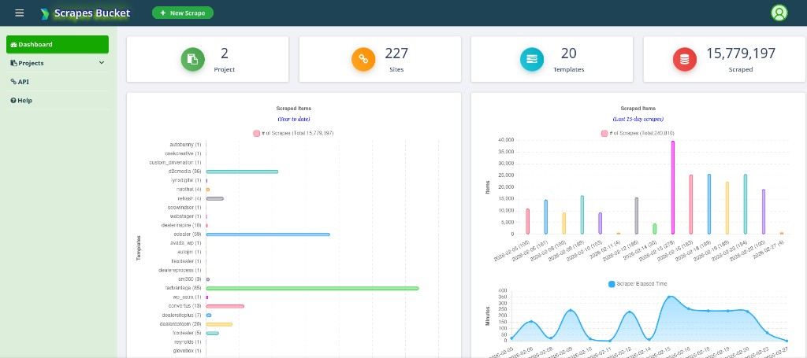

# VDP URL Scraper (Scrapes Bucket)

Django application for managing dealer **vehicle detail page (VDP)** scraping: target sites, spider templates, crawl stats, and a dashboard for monitoring scrape volume over time. Scrapy spiders live under `scrapebucket/` and persist results through Django pipelines.



## Features

- **Web dashboard** — KPIs (projects, sites, templates, scraped item counts), YTD template breakdown, recent scrape activity, and scraper elapsed-time trends.
- **Many dealer templates** — 30+ Scrapy spiders (WordPress themes, Dealer Inspire, Trader/Convertus, JSON APIs, Selenium/Playwright where needed).
- **REST API** — Supporting integrations under `project/api/`.
- **Ops hooks** — Optional FTP export of VDP CSVs, crawl logging to the database, cron-friendly `runspider.py` entrypoint.

## Stack

- Python 3.9+ (3.13 supported)
- Django, Scrapy, Django REST Framework
- PostgreSQL or SQLite (see settings)
- Optional: Selenium / Playwright / undetected-chromedriver for specific spiders

## Repository layout

```
├── docs/                   # Project documentation assets (e.g. dashboard screenshot)
├── fixtures/               # Sample / initial data
├── logs/                   # Spider log output (create as needed)
├── project/                # Main Django app (models, views, admin, API, templates)
├── scrapebucket/           # Scrapy project
│   └── scrapebucket/       # settings, spiders, pipelines, middlewares, helpers
├── static/                 # CSS, JS
├── users/                  # Auth and user-facing views
├── webscraping/            # Django project (settings, URLs, WSGI/ASGI)
├── manage.py
├── runspider.py            # Twisted/Scrapy runner (sequential crawls from DB targets)
├── scrapy.cfg
└── requirements.txt
```

## Quick start (local)

### 1. Clone and virtualenv

```bash
git clone https://github.com/paultumabini/vdp-urls-scraper.git
cd vdp-urls-scraper
python3 -m venv venv
source venv/bin/activate   # Windows: venv\Scripts\activate
pip install -r requirements.txt
```

### 2. Environment variables

For day-to-day **development**, you can rely on defaults in `webscraping/settings.py` (`DEBUG` defaults to `True` when `DJANGO_DEBUG` is unset). For **production**, set at least:

| Variable | Purpose |
|----------|---------|
| `DJANGO_DEBUG` | Set to `0` or `false` in production |
| `DJANGO_SECRET_KEY` | Required when `DEBUG` is false (never use the repo fallback key) |
| `DJANGO_ALLOWED_HOSTS` | Comma-separated hostnames |
| `POSTGRES_*` / `DB_*` | See `settings.py` for database configuration |
| `AIM_FTP_HOST`, `AIM_FTP_USER`, `AIM_FTP_PASS` | FTP export of VDP CSVs (optional locally) |
| `AVAIM_*` / `GS_*` | External API integrations where used |

Example (optional shell file, e.g. `~/.envars`):

```bash
export DJANGO_SECRET_KEY="your-secret-key"
export DJANGO_DEBUG=1
# export DJANGO_ALLOWED_HOSTS=localhost,127.0.0.1
# export AIM_FTP_HOST=...
# export AIM_FTP_USER=...
# export AIM_FTP_PASS=...
```

### 3. Database and superuser

```bash
venv/bin/python manage.py migrate
venv/bin/python manage.py createsuperuser
venv/bin/python manage.py runserver
```

Open the app (default: `http://127.0.0.1:8000/`) and `/admin/` as needed.

## Running spiders

From the **repository root** (with Django/Scrapy environment and `DJANGO_SETTINGS_MODULE` available as in `runspider.py`):

```bash
# Run one spider name against all active targets that use it (see scrapebucket URLs helper)
venv/bin/python runspider.py -s <spider_name>

# Examples
venv/bin/python runspider.py -s webstager
venv/bin/python runspider.py -s all    # wipes all Scrape rows first, then runs every active target
```

Ad-hoc Scrapy invocation (single site), from the **repository root** (where `scrapy.cfg` lives):

```bash
scrapy crawl <spider_name> -a url=https://www.example.com/
```

Logs are typically written under `logs/` if you configure cron or wrappers to do so.

## Production notes

- Run Django behind **Gunicorn** (or uwsgi) and **Nginx** (or similar).
- Use **systemd** or **cron** for scheduled `runspider.py` jobs; source the same env file as the web app.
- Set **`DJANGO_DEBUG=0`**, a strong **`DJANGO_SECRET_KEY`**, and proper **`DJANGO_ALLOWED_HOSTS`** (avoid `*` in production).
- See `webscraping/settings.py` for CORS, `REST_FRAMEWORK`, and storage options.

## License / contact

Project by **paultumabini** — [github.com/paultumabini/vdp-urls-scraper](https://github.com/paultumabini/vdp-urls-scraper).
